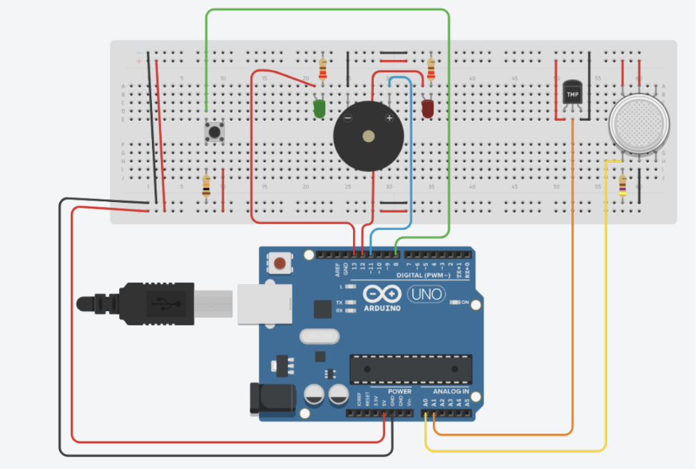

# Course Project in Embedded Systems

### Purpose and Explanation of the Project
The project implements the basic functionality of a fire alarm system. The system monitors the electrical parameters of a temperature sensor as well as a smoke sensor. When values exceed certain degrees Celsius and percentage of carbon dioxide content in the air, the alarm activates and begins to beep. 

Just like a real fire alarm system, two lamps identify the status of the system and the presence of a fire:
* **Solid Green Light**: Indicates there is no fire.
* **Flashing Red Light**: Indicates excessive gas content as well as an excessively high temperature. 

The alarm in this project is represented by a **Piezo Buzzer**. After the fire is cleared, the alarm can be stopped by holding down the control button for **3 seconds**. The button only functions if the fire hazards have already dropped back below the thresholds.

---

### Engineering Implementation
An **Arduino UNO** development board containing an **ATmega328P** microprocessor was used for this project. 

#### Hardware Component Mapping
| Functional Element | Electrical Component |
| :--- | :--- |
| **Green lamp** | Green LED |
| **Red lamp** | Red LED |
| **Alarm** | Piezo buzzer |
| **Alarm stop button** | 4-pin tactile button 12x12x5 mm |
| **Temperature sensor** | TMP36 |
| **Smoke sensor** | MQ135 |
| **Resistors for LEDs** | 2 x 220 Ohm |
| **Resistor for smoke sensor** | 470 Ohm |
| **Resistor for button** | 10 KOhm |

#### Wiring and I/O Configuration
* **Analog Inputs (`A0` & `A1`)**: The sensors transfer analog data to the Arduino. The internal Analog-to-Digital Converter (ADC) translates these signals into digital values ranging from `0` to `1023` for the microprocessor.
* **Digital Input (`Pin 8`)**: Dedicated to the tactile button to read states `1` (pressed) or `0` (released).
* **Outputs (`Pins 11, 12, 13`)**: The two LEDs receive simple digital signals (`HIGH`/`LOW`). The Piezo Buzzer utilizes pulse-width modulation techniques to generate audio frequencies by rapidly alternating square wave cycles (`0 -> 1 -> 0`) depending on the target pitch. For instance, a 1000 Hz signal generates 1000 complete cycles (amounting to 2000 individual signal changes/oscillations per second).

| Element | Variable Name | Arduino Pin |
| :--- | :--- | :--- |
| Smoke Sensor | `smokePin` | A0 |
| Temperature Sensor | `tempPin` | A1 |
| Green LED | `greenLED` | 13 |
| Red LED | `redLED` | 12 |
| Button | `buttonPin` | 8 |
| Piezo Speaker | `piezoPin` | 11 |

---

---

### Software Implementation

#### Program Logic Flowchart (Summary)
1. **`setup()`**: Configures `piezoPin`, `redLED`, and `greenLED` as `OUTPUT`, and `buttonPin` as `INPUT`.
2. **`loop()`**: Continuously reads `tempValue` and `smokeValue`.
3. **Condition Check**: If `tempValue > 205` AND `smokeValue > 80`, it turns off the green LED and enters the infinite Alarm Loop. Otherwise, the Green LED stays `HIGH`.
4. **Alarm Loop**: Flashes the Red LED, sounds the 2000 Hz buzzer, and introduces delays. It breaks the loop only if the button is pressed AND parameters drop below thresholds (`tempValue <= 200` OR `smokeValue <= 80`).
